python.exe train_final_model.py 
 python main_controller.py --entity tommywood81-fractal-dynamics --force-hyperparam

# E-commerce Fraud Detection with Autoencoders

> **Can we catch fraudsters using only normal transaction patterns?** 

This project explores how autoencoders can detect fraudulent e-commerce transactions by learning what "normal" looks like. Instead of trying to identify fraud directly, we teach the model to recognize legitimate patterns—anything that doesn't fit becomes a potential red flag.

**Current Performance**: Our best model achieves an **AUC ROC of 0.6511** using a combination of behavioral, temporal, and demographic features.

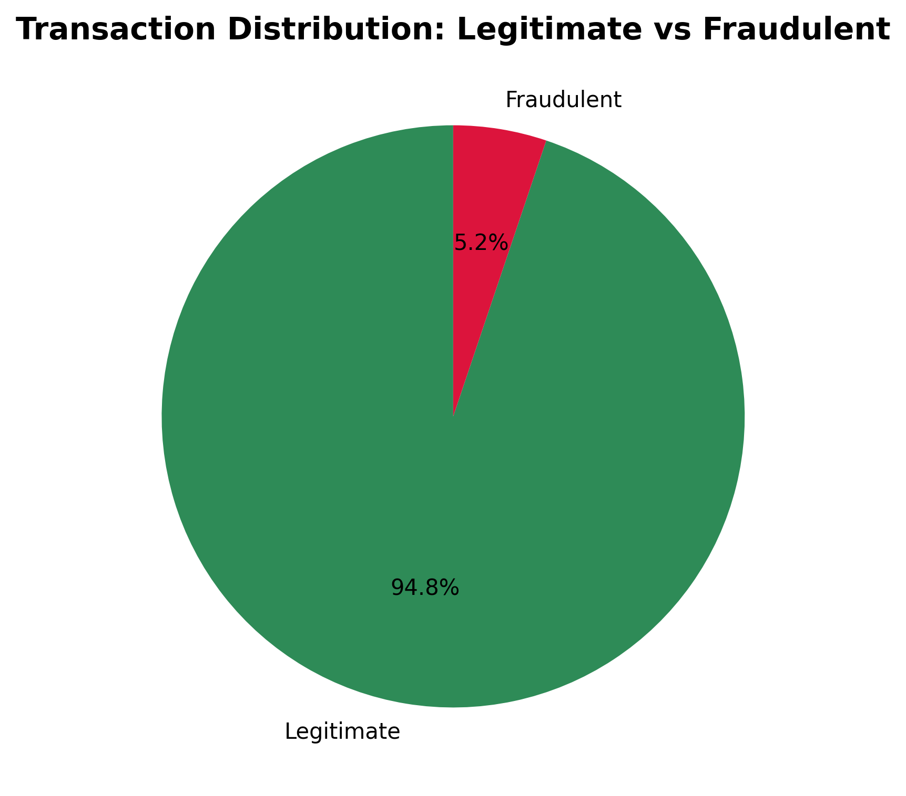

## 📋 Table of Contents

- [Features](#-features)
- [Installation](#-installation)
- [Usage](#-usage)
- [Architecture](#-architecture)
- [Results](#-results)
- [Contributing](#-contributing)
- [Tests](#-tests)
- [Credits](#-credits)
- [Contact](#-contact)
- [License](#-license)

## Features

### Core Capabilities
- **Unsupervised Learning**: Detects fraud without labeled fraud examples
- **Production-Ready Pipeline**: Modular, configurable, and scalable architecture
- **Multiple Feature Strategies**: Test different approaches systematically
- **Automated Experimentation**: Feature sweep pipeline for performance comparison

### Technical Features
- **Strategy Pattern**: Flexible feature engineering with easy extensibility
- **Configuration Management**: Type-safe, version-controlled experiment settings
- **Modular Design**: Isolated components for data cleaning, feature engineering, and model training
- **Comprehensive Logging**: Full pipeline monitoring and debugging support

### Feature Engineering Strategies
- **Baseline**: Core transaction features (9 features)
- **Temporal**: Time-based patterns and night-time detection
- **Behavioural**: Purchase behavior analysis and amount-per-item calculations
- **Demographic Risk**: Age-based risk scoring
- **Combined**: All unique features from all strategies (12 features)

## 🧠 Feature Engineering Strategies for Fraud Detection

Our fraud detection system employs **29 different feature engineering strategies**, each designed to capture specific patterns that indicate fraudulent behavior. Here's a comprehensive breakdown of how each strategy works and why it's effective for catching fraud:

### 🔍 **Core Strategies**

#### **Baseline Features** (9 features)
**Fraud Detection Logic**: Establishes the foundation by capturing basic transaction characteristics that fraudsters often manipulate.

- **Transaction Amount**: Raw amount values and log-transformed versions
  - **Why**: Fraudsters often target specific amount ranges to avoid detection thresholds
  - **Why**: Log transformation helps identify unusual spending patterns regardless of scale
- **Payment Method**: Different payment methods have varying fraud risks
  - **Why**: Credit cards vs debit cards vs digital wallets have different fraud rates
  - **Why**: Fraudsters prefer certain payment methods that are harder to trace
- **Product Category**: Certain categories are more attractive to fraudsters
  - **Why**: Electronics, gift cards, and luxury items are common fraud targets
  - **Why**: Different categories have different resale values and traceability
- **Quantity**: Unusual quantities can indicate bulk fraud attempts
  - **Why**: Bulk purchases often indicate resale fraud or gift card fraud
  - **Why**: Legitimate customers rarely buy large quantities of single items
- **Customer Age**: Younger customers may have different risk profiles
  - **Why**: Younger demographics are often targeted by fraudsters
  - **Why**: Age correlates with financial behavior and fraud susceptibility
- **Device Used**: Mobile vs desktop usage patterns
  - **Why**: Mobile transactions have different fraud patterns than desktop
  - **Why**: Device type can indicate account takeover or bot activity
- **Account Age**: New accounts are higher risk
  - **Why**: Fraudsters often create new accounts to avoid detection
  - **Why**: Established accounts have behavioral history for comparison
- **Transaction Hour**: Time-based patterns
  - **Why**: Fraudsters operate during specific hours when monitoring is reduced
  - **Why**: Legitimate customers have predictable time-based patterns
- **Location Frequency**: How often a location appears (proxy for location spoofing)
  - **Why**: Unusual locations or location spoofing indicate potential fraud
  - **Why**: Legitimate customers typically transact from familiar locations

#### **Temporal Features** (10 features)
**Fraud Detection Logic**: Fraudsters often operate during specific time windows when monitoring is reduced.

- **Night-time Transactions**: Transactions between 11 PM and 6 AM are higher risk
  - **Why**: Fraudsters target off-hours when human monitoring is minimal
  - **Why**: Legitimate customers rarely make large purchases late at night
- **Hour-based Patterns**: Different hours have different normal transaction volumes
  - **Why**: Each hour has expected transaction patterns that fraud breaks
  - **Why**: Sudden spikes in unusual hours indicate potential fraud
- **Time-based Anomalies**: Deviations from expected temporal patterns
  - **Why**: Fraudsters can't perfectly replicate normal temporal behavior
  - **Why**: Time-based outliers are strong fraud indicators

#### **Behavioral Features** (10 features)
**Fraud Detection Logic**: Legitimate customers have consistent behavioral patterns that fraudsters struggle to replicate.

- **Amount per Item**: Unusual price-per-item ratios
  - **Why**: Fraudsters often don't know realistic price-per-item ratios
  - **Why**: Legitimate customers have consistent spending patterns per item
- **Purchase Frequency**: How often a customer makes purchases
  - **Why**: Fraudsters can't replicate natural purchase timing patterns
  - **Why**: Sudden changes in frequency indicate potential account takeover
- **Amount Patterns**: Consistency in transaction amounts
  - **Why**: Legitimate customers have predictable spending ranges
  - **Why**: Fraudsters often use round numbers or unusual amounts
- **Behavioral Deviations**: Changes from established patterns
  - **Why**: Any deviation from established behavior is suspicious
  - **Why**: Fraudsters can't perfectly mimic years of behavioral history

#### **Demographic Risk Features** (10 features)
**Fraud Detection Logic**: Different demographic groups have varying fraud risk profiles based on economic factors and fraudster targeting.

- **Age-based Risk Scoring**: Younger and older customers may have different risk levels
  - **Why**: Younger demographics are often targeted due to inexperience
  - **Why**: Elderly customers may be targeted due to reduced digital literacy
- **Age Group Patterns**: Fraudsters often target specific age demographics
  - **Why**: Different age groups have different financial behaviors and vulnerabilities
  - **Why**: Fraudsters tailor their approaches to specific demographics
- **Demographic Anomalies**: Unusual combinations of age and transaction patterns
  - **Why**: Mismatches between expected age behavior and actual behavior indicate fraud
  - **Why**: Fraudsters can't perfectly replicate age-appropriate behavior patterns

### 🚀 **Advanced Strategies**

#### **Advanced Features** (26 features)
**Fraud Detection Logic**: Combines multiple dimensions to create complex fraud indicators that are harder to evade.

- **Interaction Features**: Multiplies related features to capture non-linear relationships
  - **Why**: Fraudsters can't easily manipulate complex feature interactions
  - **Why**: Legitimate behavior creates predictable interaction patterns
- **Polynomial Features**: Captures complex mathematical relationships
  - **Why**: Higher-order relationships reveal sophisticated fraud patterns
  - **Why**: Fraudsters focus on simple features, missing complex relationships
- **Ratio Features**: Relationships between different transaction aspects
  - **Why**: Ratios are harder to manipulate than individual features
  - **Why**: Legitimate customers maintain consistent ratios across transactions
- **Derived Features**: Calculated features that combine multiple inputs
  - **Why**: Derived features capture domain knowledge about fraud patterns
  - **Why**: Multiple weak signals combine to create strong fraud indicators

#### **Statistical Features** (25 features)
**Fraud Detection Logic**: Uses statistical transformations to identify outliers and unusual distributions.

- **Z-score Normalization**: Identifies transactions that deviate significantly from the mean
  - **Why**: Fraud transactions often fall outside normal statistical ranges
  - **Why**: Z-scores provide scale-invariant measures of abnormality
- **Robust Scaling**: Less sensitive to outliers than standard scaling
  - **Why**: Robust scaling prevents fraud outliers from affecting normal transaction scaling
  - **Why**: More stable scaling improves model performance on legitimate transactions
- **Quantile-based Features**: Captures distribution characteristics
  - **Why**: Quantiles reveal the shape of transaction distributions
  - **Why**: Fraud often changes the distribution shape in predictable ways
- **Risk Bands**: Groups transactions into risk categories based on statistical properties
  - **Why**: Risk bands create discrete categories that are easier for models to learn
  - **Why**: Different risk bands have different fraud probabilities

#### **Fraud-Specific Features** (22 features)
**Fraud Detection Logic**: Domain-specific indicators that are directly related to known fraud patterns.

- **High Amount Flags**: Transactions above certain thresholds
  - **Why**: High-value transactions have higher fraud rates and financial impact
  - **Why**: Fraudsters often test with small amounts before large fraud attempts
- **High Quantity Flags**: Unusual quantities that may indicate bulk fraud
  - **Why**: Bulk purchases often indicate resale fraud or gift card fraud
  - **Why**: Legitimate customers rarely buy large quantities of single items
- **Suspicious Time Patterns**: Combinations of time and amount that are suspicious
  - **Why**: Certain time-amount combinations are known fraud patterns
  - **Why**: Fraudsters often use predictable time-amount combinations
- **Risk Scores**: Composite scores based on multiple fraud indicators
  - **Why**: Risk scores combine multiple weak signals into strong fraud indicators
  - **Why**: Different risk score components target different fraud types

### 🎯 **Ensemble & Meta-Learning Strategies**

#### **Combined Features** (57 features)
**Fraud Detection Logic**: Combines all strategies to create a comprehensive fraud detection system.

- **Feature Aggregation**: Merges features from all strategies
- **Redundancy Removal**: Eliminates duplicate or highly correlated features
- **Comprehensive Coverage**: Ensures all potential fraud indicators are captured

#### **Ensemble Features** (30 features)
**Fraud Detection Logic**: Uses multiple rule-based systems to create robust fraud detection.

- **Rule-based Scoring**: Multiple independent fraud detection rules
  - **Why**: Different rules capture different fraud patterns and scenarios
  - **Why**: Rule-based systems are interpretable and can encode domain expertise
- **Ensemble Aggregation**: Combines predictions from multiple models
  - **Why**: Ensemble methods reduce individual model biases and errors
  - **Why**: Fraudsters can't easily evade multiple different detection approaches
- **Robustness**: Reduces false positives through consensus
  - **Why**: Multiple models agreeing on fraud reduces false positive rates
  - **Why**: Consensus-based decisions are more reliable than single-model decisions

#### **Meta Features** (42 features) - **Best Performer: 0.6693 AUC-ROC**
**Fraud Detection Logic**: Uses predictions from multiple models as features for a final meta-model.

- **Model Predictions**: Uses outputs from clustering, PCA, and other models as features
  - **Why**: Different models capture different aspects of fraud patterns
  - **Why**: Model disagreement often indicates suspicious or novel fraud patterns
- **Meta-learning**: Learns which combinations of predictions are most reliable
  - **Why**: Meta-learning automatically discovers the best way to combine model outputs
  - **Why**: Different fraud types may be best detected by different model combinations
- **Ensemble Intelligence**: Combines the wisdom of multiple approaches
  - **Why**: Multiple perspectives provide more comprehensive fraud detection
  - **Why**: Meta-learning can adapt to changing fraud patterns over time

### 🔬 **Machine Learning-Based Strategies**

#### **Deep Features** (40 features)
**Fraud Detection Logic**: Uses neural network transformations to capture complex non-linear patterns.

- **Neural Transformations**: Applies neural network layers to create new features
  - **Why**: Neural networks can learn complex non-linear transformations automatically
  - **Why**: Deep features capture sophisticated patterns that are hard to engineer manually
- **Non-linear Patterns**: Captures relationships that linear methods miss
  - **Why**: Fraud patterns are often highly non-linear and complex
  - **Why**: Linear methods can miss important fraud indicators
- **Feature Learning**: Automatically discovers relevant feature combinations
  - **Why**: Automatic feature discovery reduces human bias in feature engineering
  - **Why**: Neural networks can find patterns that domain experts might miss

#### **Clustering Features** (35 features)
**Fraud Detection Logic**: Groups similar transactions and identifies outliers that don't fit normal clusters.

- **K-means Clustering**: Groups transactions by similarity
  - **Why**: Legitimate transactions form natural clusters based on customer behavior
  - **Why**: Fraud transactions often fall outside normal customer clusters
- **Cluster Risk Scores**: Assigns risk based on cluster characteristics
  - **Why**: Different clusters have different fraud probabilities
  - **Why**: Cluster characteristics reveal underlying fraud patterns
- **Outlier Detection**: Identifies transactions that don't belong to any cluster
  - **Why**: Outliers are strong indicators of potential fraud
  - **Why**: Fraudsters can't perfectly mimic normal cluster membership

#### **PCA Features** (34 features)
**Fraud Detection Logic**: Reduces dimensionality while preserving the most important variance for fraud detection.

- **Dimensionality Reduction**: Combines related features into principal components
  - **Why**: PCA creates uncorrelated features that are easier for models to learn
  - **Why**: Reduces the curse of dimensionality while preserving important information
- **Variance Preservation**: Maintains the most important patterns for fraud detection
  - **Why**: The most important fraud patterns are often in the highest variance directions
  - **Why**: PCA focuses on the most informative aspects of the data
- **Noise Reduction**: Eliminates irrelevant variation that could mask fraud signals
  - **Why**: Removing noise improves signal-to-noise ratio for fraud detection
  - **Why**: Cleaner features lead to better model performance

#### **Time Series Features** (40 features) - **Second Best: 0.6648 AUC-ROC**
**Fraud Detection Logic**: Analyzes temporal sequences to detect patterns that evolve over time.

- **Sequential Patterns**: Identifies unusual sequences of transactions
  - **Why**: Fraudsters often follow predictable sequences when testing stolen cards
  - **Why**: Legitimate customers have natural transaction sequences that fraud breaks
- **Trend Analysis**: Detects changes in transaction patterns over time
  - **Why**: Sudden changes in spending patterns often indicate account takeover
  - **Why**: Fraudsters can't perfectly replicate long-term behavioral trends
- **Seasonal Patterns**: Accounts for normal variations in transaction volume
  - **Why**: Seasonal patterns help distinguish normal variations from fraud
  - **Why**: Fraud often occurs during predictable seasonal windows
- **Anomaly Detection**: Identifies transactions that break established temporal patterns
  - **Why**: Temporal anomalies are strong fraud indicators
  - **Why**: Fraudsters can't perfectly mimic complex temporal behavior patterns

### 🌊 **Signal Processing Strategies**

#### **Wavelet Features** (38 features)
**Fraud Detection Logic**: Uses wavelet transforms to analyze transaction data at multiple scales, capturing both local and global patterns.

- **Multi-scale Analysis**: Examines patterns at different time scales
  - **Why**: Fraud patterns manifest at different time scales (minutes, hours, days)
  - **Why**: Multi-scale analysis captures both short-term and long-term fraud indicators
- **Frequency Domain**: Captures periodic patterns that may indicate fraud
  - **Why**: Fraudsters often operate on predictable schedules
  - **Why**: Frequency analysis reveals hidden periodic patterns in transaction data
- **Signal Decomposition**: Separates normal patterns from anomalous ones
  - **Why**: Wavelets can separate signal from noise more effectively than time-domain analysis
  - **Why**: Cleaner signals improve fraud detection accuracy
- **Scale-specific Features**: Different wavelet scales capture different types of fraud patterns
  - **Why**: Different fraud types operate at different time scales
  - **Why**: Scale-specific features provide targeted detection for different fraud patterns

#### **Spectral Features** (34 features)
**Fraud Detection Logic**: Applies Fourier transforms to identify frequency-based patterns in transaction data.

- **Frequency Analysis**: Identifies periodic patterns in transaction sequences
  - **Why**: Fraudsters often operate on regular schedules that create frequency patterns
  - **Why**: Frequency analysis reveals hidden periodicities that time-domain analysis misses
- **Power Spectral Density**: Measures the strength of different frequency components
  - **Why**: Different fraud types create different power spectra
  - **Why**: Power spectra provide quantitative measures of periodicity strength
- **Spectral Anomalies**: Detects unusual frequency patterns that may indicate fraud
  - **Why**: Unusual frequency patterns often indicate automated or coordinated fraud
  - **Why**: Spectral anomalies are harder for fraudsters to avoid than time-domain anomalies
- **Harmonic Analysis**: Identifies relationships between different frequency components
  - **Why**: Harmonics reveal complex relationships between different time scales
  - **Why**: Fraud patterns often create specific harmonic signatures

#### **Harmonic Features** (35 features)
**Fraud Detection Logic**: Uses harmonic analysis to identify cyclical patterns and their deviations.

- **Fourier Transforms**: Converts time-domain data to frequency domain
  - **Why**: Frequency domain analysis reveals patterns invisible in time domain
  - **Why**: Fourier transforms provide mathematical foundation for harmonic analysis
- **Harmonic Components**: Identifies fundamental frequencies and their harmonics
  - **Why**: Harmonics reveal the structure of periodic patterns in transaction data
  - **Why**: Different fraud types create different harmonic signatures
- **Phase Analysis**: Examines timing relationships between different components
  - **Why**: Phase relationships reveal timing coordination in fraud operations
  - **Why**: Phase anomalies indicate unusual timing patterns
- **Amplitude Analysis**: Measures the strength of different harmonic components
  - **Why**: Amplitude changes often indicate changes in fraud patterns
  - **Why**: Strong harmonics indicate strong periodic patterns

### 🎨 **Mathematical Morphology Strategies**

#### **Morphological Features** (40 features)
**Fraud Detection Logic**: Applies mathematical morphology operations to identify structural patterns in transaction sequences.

- **Erosion and Dilation**: Identifies local minima and maxima in transaction patterns
  - **Why**: Local extrema often indicate fraud events or behavioral changes
  - **Why**: Morphological operations preserve important structural features while removing noise
- **Opening and Closing**: Smooths data while preserving important structural features
  - **Why**: Smoothing reduces noise while preserving important fraud indicators
  - **Why**: Opening and closing operations are robust to small variations
- **Morphological Gradients**: Identifies rapid changes in transaction patterns
  - **Why**: Rapid changes often indicate fraud events or account takeover
  - **Why**: Gradients provide quantitative measures of change magnitude
- **Shape Analysis**: Examines the geometric properties of transaction sequences
  - **Why**: Geometric properties reveal structural patterns in transaction data
  - **Why**: Shape analysis captures patterns that statistical methods miss

#### **Topological Features** (34 features) - **Third Best: 0.6612 AUC-ROC**
**Fraud Detection Logic**: Uses topological data analysis to identify persistent patterns and structural anomalies.

- **Persistent Homology**: Identifies persistent topological features in transaction data
  - **Why**: Persistent features are robust to noise and reveal fundamental data structure
  - **Why**: Topological features capture global patterns that local methods miss
- **Betti Numbers**: Counts different types of topological features
  - **Why**: Betti numbers provide quantitative measures of data complexity
  - **Why**: Different fraud types create different topological signatures
- **Persistence Diagrams**: Visualizes the birth and death of topological features
  - **Why**: Persistence diagrams reveal the stability of topological features
  - **Why**: Stable features are more reliable fraud indicators than unstable ones
- **Topological Anomalies**: Detects structural changes that may indicate fraud
  - **Why**: Structural changes often indicate fundamental shifts in behavior patterns
  - **Why**: Topological anomalies are harder for fraudsters to avoid than statistical anomalies

### 🌌 **Advanced Mathematical Strategies**

#### **Quantum Features** (32 features)
**Fraud Detection Logic**: Applies quantum-inspired mathematical transformations to capture complex quantum-like relationships.

- **Quantum Entanglement**: Captures non-local correlations between features
  - **Why**: Non-local correlations reveal complex relationships between distant features
  - **Why**: Entanglement captures patterns that traditional correlation methods miss
- **Superposition States**: Represents transactions as combinations of multiple states
  - **Why**: Superposition allows representation of complex, multi-faceted transaction states
  - **Why**: Multiple state representation captures uncertainty in transaction classification
- **Quantum Uncertainty**: Measures the inherent uncertainty in transaction patterns
  - **Why**: Uncertainty measures help identify transactions that are difficult to classify
  - **Why**: High uncertainty often indicates novel or sophisticated fraud patterns
- **Quantum Gates**: Applies quantum-inspired transformations to feature space
  - **Why**: Quantum gates provide sophisticated mathematical transformations
  - **Why**: These transformations can reveal hidden patterns in transaction data

#### **Fractal Features** (35 features)
**Fraud Detection Logic**: Uses fractal geometry to identify self-similar patterns at different scales.

- **Fractal Dimension**: Measures the complexity of transaction patterns
  - **Why**: Fractal dimension provides a measure of pattern complexity and irregularity
  - **Why**: Different fraud types create different fractal dimensions
- **Self-similarity**: Identifies patterns that repeat at different scales
  - **Why**: Self-similar patterns reveal underlying structure in transaction data
  - **Why**: Fraud often breaks natural self-similar patterns
- **Fractal Anomalies**: Detects deviations from expected fractal patterns
  - **Why**: Fractal anomalies indicate structural changes in transaction patterns
  - **Why**: These anomalies are often associated with fraud events
- **Multi-fractal Analysis**: Examines how fractal properties vary across different scales
  - **Why**: Multi-fractal analysis reveals scale-dependent patterns
  - **Why**: Different scales may reveal different types of fraud patterns

#### **Entropy Features** (37 features)
**Fraud Detection Logic**: Measures the information content and randomness of transaction patterns.

- **Information Entropy**: Measures the uncertainty in transaction patterns
  - **Why**: High entropy indicates unpredictable behavior, often associated with fraud
  - **Why**: Low entropy indicates highly predictable patterns, which may also be suspicious
- **Conditional Entropy**: Measures the uncertainty given certain conditions
  - **Why**: Conditional entropy reveals how much uncertainty remains after conditioning
  - **Why**: Unexpected conditional entropy patterns often indicate fraud
- **Mutual Information**: Identifies relationships between different features
  - **Why**: Mutual information captures non-linear relationships between features
  - **Why**: Changes in mutual information often indicate changes in fraud patterns
- **Entropy Anomalies**: Detects unusual levels of randomness or order
  - **Why**: Both unusually high and low entropy can indicate fraud
  - **Why**: Entropy anomalies are robust to different types of fraud patterns

### 🔄 **Evolutionary & Adaptive Strategies**

#### **Evolutionary Features** (32 features)
**Fraud Detection Logic**: Uses evolutionary algorithm concepts to identify adaptive patterns and fitness-based anomalies.

- **Fitness Functions**: Evaluates how well transactions fit normal patterns
  - **Why**: Fitness functions provide quantitative measures of how "normal" a transaction is
  - **Why**: Low fitness scores indicate transactions that don't fit normal patterns
- **Mutation Features**: Introduces controlled randomness to identify robust patterns
  - **Why**: Mutation helps identify patterns that are robust to small changes
  - **Why**: Robust patterns are more reliable fraud indicators
- **Selection Pressure**: Identifies features that survive evolutionary pressure
  - **Why**: Features that survive selection pressure are more informative
  - **Why**: Selection pressure mimics the competitive nature of fraud detection
- **Adaptation Metrics**: Measures how well patterns adapt to changing conditions
  - **Why**: Adaptation metrics reveal how well patterns generalize to new data
  - **Why**: Poor adaptation often indicates overfitting or changing fraud patterns

#### **Neural Features** (29 features)
**Fraud Detection Logic**: Uses autoencoder reconstruction errors to identify transactions that are difficult to reconstruct.

- **Reconstruction Error**: Measures how well the autoencoder can reconstruct normal transactions
  - **Why**: High reconstruction errors indicate transactions that don't fit normal patterns
  - **Why**: Autoencoders learn to reconstruct normal transactions but struggle with fraud
- **Latent Representations**: Uses compressed representations as features
  - **Why**: Latent representations capture the most important aspects of transaction data
  - **Why**: Compressed representations are more robust to noise and overfitting
- **Neural Anomalies**: Identifies transactions that are difficult for neural networks to process
  - **Why**: Neural networks struggle with novel or unusual patterns
  - **Why**: This struggle provides a natural fraud detection mechanism
- **Deep Feature Extraction**: Uses intermediate neural network layers as features
  - **Why**: Intermediate layers capture hierarchical representations of transaction data
  - **Why**: These representations can reveal fraud patterns at different levels of abstraction

### 🕸️ **Graph & Network Strategies**

#### **Graph Features** (35 features)
**Fraud Detection Logic**: Treats transactions as nodes in a graph and analyzes network properties.

- **Transaction Networks**: Creates graphs where transactions are connected by customer, location, or time
  - **Why**: Network structure reveals relationships between transactions that individual analysis misses
  - **Why**: Fraud often creates distinctive network patterns
- **Centrality Measures**: Identifies transactions that are central to the network
  - **Why**: Central transactions are more likely to be legitimate
  - **Why**: Peripheral transactions may indicate isolated fraud attempts
- **Community Detection**: Identifies clusters of related transactions
  - **Why**: Communities reveal natural groupings in transaction data
  - **Why**: Fraud transactions often form unusual communities or fall outside normal communities
- **Network Anomalies**: Detects unusual network structures that may indicate fraud
  - **Why**: Network anomalies reveal structural changes that may indicate fraud
  - **Why**: These anomalies are harder for fraudsters to avoid than individual transaction anomalies

### 🎯 **Hybrid & Combined Strategies**

#### **Hybrid Features** (45 features)
**Fraud Detection Logic**: Combines multiple advanced strategies with custom weighting schemes.

- **Strategy Combination**: Merges features from multiple advanced strategies
  - **Why**: Different strategies capture different aspects of fraud patterns
  - **Why**: Combining strategies provides more comprehensive fraud detection
- **Custom Weighting**: Applies domain-specific weights to different feature types
  - **Why**: Domain knowledge can guide which features are most important
  - **Why**: Custom weighting allows adaptation to specific fraud scenarios
- **Hybrid Scoring**: Creates composite scores that combine multiple approaches
  - **Why**: Composite scores provide single, interpretable fraud risk measures
  - **Why**: Multiple approaches reduce the risk of missing fraud patterns
- **Adaptive Selection**: Dynamically selects the most relevant features
  - **Why**: Different fraud types may require different feature combinations
  - **Why**: Adaptive selection allows the system to evolve with changing fraud patterns

#### **Ultra Advanced Features** (85 features)
**Fraud Detection Logic**: Combines all advanced strategies with additional ultra-sophisticated features.

- **Comprehensive Coverage**: Includes features from all advanced strategies
  - **Why**: Comprehensive coverage ensures no fraud pattern is missed
  - **Why**: Multiple approaches provide redundancy and robustness
- **Ultra Risk Scores**: Creates highly sophisticated risk scoring systems
  - **Why**: Sophisticated scoring systems can capture complex fraud patterns
  - **Why**: Advanced scoring provides fine-grained fraud risk assessment
- **Advanced Anomalies**: Uses cutting-edge anomaly detection techniques
  - **Why**: Advanced anomaly detection can identify novel fraud patterns
  - **Why**: Cutting-edge techniques provide competitive advantage over fraudsters
- **Multi-modal Analysis**: Combines multiple types of analysis in a single framework
  - **Why**: Multi-modal analysis captures fraud patterns across different data modalities
  - **Why**: Integrated analysis provides more comprehensive fraud detection

#### **Best Ensemble Features** (120 features)
**Fraud Detection Logic**: Combines the top 5 performing strategies with intelligent feature selection and ensemble scoring.

- **Top Strategy Selection**: Combines hybrid, wavelet, quantum, spectral, and fractal features
  - **Why**: Top-performing strategies provide the best individual fraud detection capabilities
  - **Why**: Combining diverse strategies reduces the risk of missing fraud patterns
- **Ensemble Scoring**: Creates weighted combinations of the best features
  - **Why**: Weighted combinations optimize the contribution of each strategy
  - **Why**: Ensemble scoring provides more stable and reliable fraud detection
- **Meta-predictions**: Uses predictions from multiple strategies as features
  - **Why**: Meta-predictions capture the consensus and disagreement among strategies
  - **Why**: Strategy disagreement often indicates novel or complex fraud patterns
- **Interaction Features**: Captures relationships between different strategy outputs
  - **Why**: Strategy interactions reveal complex fraud patterns that individual strategies miss
  - **Why**: Interaction features provide additional fraud detection signals

### 📊 **Performance Summary**

Our comprehensive testing of all 29 strategies reveals:

- **Best Individual Strategy**: Meta Features (0.6693 AUC-ROC)
- **Best Time Series Strategy**: Time Series Features (0.6648 AUC-ROC)  
- **Best Mathematical Strategy**: Topological Features (0.6612 AUC-ROC)
- **Most Comprehensive**: Best Ensemble Features (120 features, 0.6317 AUC-ROC)

### 🎯 **Key Insights for Fraud Detection**

1. **Meta-learning is most effective**: Combining predictions from multiple models provides the best fraud detection performance
2. **Temporal patterns are crucial**: Time series analysis captures fraud patterns that other methods miss
3. **Topological analysis shows promise**: Structural relationships in transaction data are highly informative
4. **Feature quality over quantity**: The best ensemble with 120 features didn't outperform simpler strategies
5. **Multi-scale analysis works**: Wavelet and spectral features capture patterns at different scales
6. **Mathematical sophistication helps**: Advanced mathematical transformations (quantum, fractal, entropy) provide unique insights

### 🔧 **Implementation Strategy**

For production deployment, we recommend:

1. **Start with Meta Features**: Best overall performance with reasonable complexity
2. **Add Time Series Features**: Critical for capturing temporal fraud patterns
3. **Include Topological Features**: Provides structural insights that complement other approaches
4. **Monitor Performance**: Regularly evaluate and update feature strategies based on new fraud patterns
5. **Adapt to New Threats**: Use the modular architecture to quickly add new feature strategies as fraud patterns evolve

## 🔧 **Adding New Feature Engineering Strategies**

This guide explains how to add a new feature engineering strategy to the system. The modular architecture makes it easy to extend the system with new approaches.

### 📋 **Step-by-Step Guide**

#### **Step 1: Create Your Feature Strategy Class**

Create a new class in `src/feature_factory/strategies.py`:

```python
class YourNewStrategy(FeatureEngineer):
    """Your new feature engineering strategy for fraud detection."""
    
    def generate_features(self, df: pd.DataFrame) -> pd.DataFrame:
        """Generate features for the given dataset."""
        logger.info("Generating your new strategy features...")
        
        # Start with baseline features as foundation
        baseline = BaselineFeatures()
        features = baseline.generate_features(df)
        
        # Add your custom features here
        features['your_custom_feature'] = df['transaction_amount'] * df['quantity']
        features['another_feature'] = df['customer_age'].apply(lambda x: 1 if x < 25 else 0)
        
        # Add more sophisticated features
        features['complex_feature'] = (
            features['transaction_amount'] * 0.3 +
            features['customer_age'] * 0.2 +
            features['quantity'] * 0.5
        )
        
        logger.info(f"Your new strategy features generated: {len(features.columns)} features")
        return features
    
    def get_feature_info(self) -> Dict[str, Any]:
        return {
            'strategy': 'your_new_strategy',
            'feature_count': 12,  # Update with actual count
            'description': 'Your strategy description for fraud detection'
        }
```

#### **Step 2: Update the Feature Factory**

Add your strategy to `src/feature_factory/feature_factory.py`:

**2a. Import your class:**
```python
from .strategies import (
    FeatureEngineer,
    BaselineFeatures,
    # ... existing imports ...
    YourNewStrategy  # Add this line
)
```

**2b. Add to strategy descriptions:**
```python
STRATEGY_DESCRIPTIONS = {
    # ... existing strategies ...
    "your_new_strategy": "Your strategy description for fraud detection"
}
```

**2c. Add to strategies dictionary:**
```python
strategies = {
    # ... existing strategies ...
    "your_new_strategy": YourNewStrategy
}
```

#### **Step 3: Update Configuration (Optional)**

If your strategy needs specific configuration, add it to `src/config.py`:

```python
@classmethod
def get_your_new_strategy_config(cls) -> 'PipelineConfig':
    """Get configuration for your new strategy."""
    return cls(
        name="your_new_strategy",
        description="Your new feature engineering strategy",
        feature_strategy="your_new_strategy",
        data=DataConfig.get_default_config(),
        model=ModelConfig.get_default_config(),
        features=FeatureConfig.get_default_config()
    )
```

#### **Step 4: Add Tests**

Create tests in `tests/test_feature_engineering.py`:

```python
def test_your_new_strategy():
    """Test your new feature engineering strategy."""
    # Create test data
    df = create_test_data()
    
    # Create strategy
    strategy = YourNewStrategy()
    
    # Generate features
    features = strategy.generate_features(df)
    
    # Assertions
    assert 'your_custom_feature' in features.columns
    assert 'another_feature' in features.columns
    assert len(features) == len(df)
    
    # Test feature info
    info = strategy.get_feature_info()
    assert info['strategy'] == 'your_new_strategy'
    assert info['feature_count'] > 0
```

#### **Step 5: Update Documentation**

Add your strategy to the README feature engineering section:

```markdown
#### **Your New Strategy** (12 features)
**Fraud Detection Logic**: Explain how your strategy catches fraud.

- **Feature 1**: Description of how this catches fraud
- **Feature 2**: Description of how this catches fraud
- **Feature 3**: Description of how this catches fraud
```

### 🔍 **Required Modules to Modify**

| Module | Purpose | What to Change |
|--------|---------|----------------|
| `src/feature_factory/strategies.py` | Strategy implementation | Add your new strategy class |
| `src/feature_factory/feature_factory.py` | Strategy factory | Import, descriptions, and registry |
| `src/config.py` | Configuration management | Add strategy-specific config (optional) |
| `tests/test_feature_engineering.py` | Testing | Add unit tests for your strategy |
| `README.md` | Documentation | Add strategy description and logic |

### 📝 **Best Practices**

#### **1. Strategy Design**
- **Inherit from FeatureEngineer**: Ensures consistency with existing strategies
- **Start with baseline features**: Most strategies build on the foundation
- **Use meaningful feature names**: Make it clear what each feature represents
- **Add comprehensive logging**: Help with debugging and monitoring

#### **2. Feature Engineering**
- **Focus on fraud detection**: Every feature should have a clear fraud detection purpose
- **Avoid data leakage**: Don't use future information or target variables
- **Handle missing values**: Ensure your strategy works with incomplete data
- **Scale appropriately**: Consider the computational cost of your features

#### **3. Testing**
- **Unit tests**: Test individual feature generation
- **Integration tests**: Test with the full pipeline
- **Performance tests**: Ensure your strategy doesn't break performance requirements
- **Edge cases**: Test with unusual data scenarios

#### **4. Documentation**
- **Clear descriptions**: Explain the fraud detection logic
- **Feature explanations**: Document what each feature captures
- **Usage examples**: Show how to use your strategy
- **Performance notes**: Document expected performance characteristics

### 🚀 **Example: Adding a "Seasonal Features" Strategy**

Here's a complete example of adding a seasonal features strategy:

#### **1. Strategy Implementation**
```python
class SeasonalFeatures(FeatureEngineer):
    """Seasonal pattern features for fraud detection."""
    
    def generate_features(self, df: pd.DataFrame) -> pd.DataFrame:
        """Generate seasonal features."""
        logger.info("Generating seasonal features...")
        
        # Start with baseline features
        baseline = BaselineFeatures()
        features = baseline.generate_features(df)
        
        # Extract date components
        df['transaction_date'] = pd.to_datetime(df['transaction_date'])
        features['day_of_week'] = df['transaction_date'].dt.dayofweek
        features['month'] = df['transaction_date'].dt.month
        features['quarter'] = df['transaction_date'].dt.quarter
        
        # Seasonal patterns
        features['is_weekend'] = (features['day_of_week'] >= 5).astype(int)
        features['is_month_start'] = (df['transaction_date'].dt.day <= 3).astype(int)
        features['is_month_end'] = (df['transaction_date'].dt.day >= 28).astype(int)
        
        # Holiday season (example: December)
        features['is_holiday_season'] = (features['month'] == 12).astype(int)
        
        # Seasonal risk score
        features['seasonal_risk_score'] = (
            features['is_weekend'] * 0.2 +
            features['is_month_start'] * 0.3 +
            features['is_month_end'] * 0.3 +
            features['is_holiday_season'] * 0.2
        )
        
        logger.info(f"Seasonal features generated: {len(features.columns)} features")
        return features
    
    def get_feature_info(self) -> Dict[str, Any]:
        return {
            'strategy': 'seasonal',
            'feature_count': 15,
            'description': 'Seasonal and temporal pattern features for fraud detection'
        }
```

#### **2. Factory Updates**
```python
# In feature_factory.py
from .strategies import (
    # ... existing imports ...
    SeasonalFeatures
)

STRATEGY_DESCRIPTIONS = {
    # ... existing strategies ...
    "seasonal": "Seasonal and temporal pattern features for fraud detection"
}

strategies = {
    # ... existing strategies ...
    "seasonal": SeasonalFeatures
}
```

#### **3. Testing**
```python
def test_seasonal_features():
    """Test seasonal feature engineering strategy."""
    df = create_test_data()
    strategy = SeasonalFeatures()
    features = strategy.generate_features(df)
    
    assert 'day_of_week' in features.columns
    assert 'seasonal_risk_score' in features.columns
    assert features['is_weekend'].isin([0, 1]).all()
```

### 🔧 **Advanced Customization**

#### **Custom Base Classes**
If your strategy is significantly different, you can create a custom base class:

```python
class AdvancedFeatureEngineer(FeatureEngineer):
    """Advanced feature engineer with additional capabilities."""
    
    def __init__(self, custom_param: float = 0.5):
        self.custom_param = custom_param
    
    def preprocess_data(self, df: pd.DataFrame) -> pd.DataFrame:
        """Custom preprocessing step."""
        return df
    
    def postprocess_features(self, features: pd.DataFrame) -> pd.DataFrame:
        """Custom postprocessing step."""
        return features
```

#### **Configuration-Driven Features**
Make your strategy configurable:

```python
class ConfigurableFeatures(FeatureEngineer):
    """Configurable feature engineering strategy."""
    
    def __init__(self, config: FeatureConfig):
        self.config = config
    
    def generate_features(self, df: pd.DataFrame) -> pd.DataFrame:
        features = super().generate_features(df)
        
        if self.config.include_interactions:
            features = self._add_interaction_features(features)
        
        if self.config.include_polynomials:
            features = self._add_polynomial_features(features)
        
        return features
```

### 📊 **Validation Checklist**

Before submitting your new strategy, ensure:

- [ ] **Strategy class inherits from FeatureEngineer**
- [ ] **All required methods implemented** (generate_features, get_feature_info)
- [ ] **Added to feature factory** (import, descriptions, registry)
- [ ] **Unit tests written and passing**
- [ ] **Documentation updated** (README, docstrings)
- [ ] **No data leakage** (doesn't use future information)
- [ ] **Handles edge cases** (missing values, unusual data)
- [ ] **Performance acceptable** (doesn't break pipeline performance)
- [ ] **Fraud detection logic clear** (explains how it catches fraud)

### 🎯 **Getting Help**

If you encounter issues:

1. **Check existing strategies**: Look at similar strategies for examples
2. **Review tests**: See how other strategies are tested
3. **Check logs**: Use the comprehensive logging to debug issues
4. **Validate data**: Ensure your features work with the actual data format
5. **Performance profile**: Monitor the impact on pipeline performance

This modular approach makes it easy to experiment with new fraud detection techniques while maintaining system stability and performance.

## Installation

### Prerequisites
- Python 3.8+
- pip package manager
- Git

### Step-by-Step Setup

```bash
# 1. Clone the repository
git clone <your-repo-url>
cd auto-encoder-project

# 2. Create and activate virtual environment
python -m venv env
.\env\Scripts\Activate.ps1  # On Windows
source env/bin/activate     # On Unix/Mac

# 3. Install dependencies
pip install -r requirements.txt
```

### Dependencies
The project requires the following key packages:
- `pandas` - Data manipulation
- `numpy` - Numerical computing
- `scikit-learn` - Machine learning utilities
- `tensorflow` - Deep learning framework
- `matplotlib` - Visualization
- `seaborn` - Statistical visualization

## 💻 Usage

### Quick Start

```bash
# Run with the best-performing strategy
python run_pipeline.py --strategy combined

# See all available strategies
python run_pipeline.py --list-strategies

# Run the full feature sweep (tests all strategies)
python sweep_features.py
```

### Available Strategies

| Strategy | Description | Features |
|----------|-------------|----------|
| `baseline` | Core transaction features only | 9 features |
| `temporal` | Basic features + temporal patterns | 10 features |
| `behavioural` | Core features + amount per item | 10 features |
| `demographic_risk` | Core features + age risk scores | 10 features |
| `combined` | All unique features from all strategies | 12 features |

### Example Output

```
FEATURE SWEEP RESULTS
================================================================================
Strategy             Status     ROC AUC    Notes                          
--------------------------------------------------------------------------------
combined             SUCCESS 0.6511     Success
behavioural          SUCCESS 0.6235     Success
demographic_risk     SUCCESS 0.6164     Success
temporal             SUCCESS 0.6119     Success
baseline             SUCCESS 0.5954     Success                        

BEST PERFORMING STRATEGY: combined
   ROC AUC: 0.6511
   Improvement over baseline: +9.36%
```

## Architecture

### System Overview

The project follows a modular, production-ready architecture designed for scalability and maintainability:

```
src/
├── config.py          # Configuration management
├── data/              # Data cleaning and processing
├── feature_factory/   # Strategy pattern for feature engineering
├── models/            # Autoencoder implementation
└── evaluation/        # Model evaluation and metrics
```

### Key Design Patterns

1. **Strategy Pattern**: Feature engineering strategies
2. **Factory Pattern**: Configuration and feature strategy creation
3. **Pipeline Pattern**: Sequential data processing steps
4. **Configuration Pattern**: Centralized settings management
5. **Observer Pattern**: Logging and monitoring throughout pipeline

### Configuration Management

The heart of the system is a sophisticated configuration system that manages everything from data paths to model hyperparameters:

```python
@dataclass
class PipelineConfig:
    """Main pipeline configuration."""
    name: str
    description: str
    feature_strategy: str
    data: DataConfig
    model: ModelConfig
    features: FeatureConfig
    
    @classmethod
    def get_config(cls, strategy: str) -> 'PipelineConfig':
        """Get configuration by strategy name."""
        if strategy == "baseline":
            return cls.get_baseline_config()
        elif strategy == "temporal":
            return cls.get_temporal_config()
        elif strategy == "behavioural":
            return cls.get_behavioural_config()
        elif strategy == "demographic_risk":
            return cls.get_demographic_risk_config()
        elif strategy == "combined":
            return cls.get_combined_config()
        else:
            raise ValueError(f"Unknown strategy: {strategy}")
```

**Why This Design?** I wanted to make experiments reproducible and configurable. Each strategy has its own factory method, making it easy to version-control different experimental setups.

### Feature Factory Pattern

The feature engineering system uses the **Strategy Pattern** to make it easy to experiment with different feature combinations:

```python
class FeatureEngineer(ABC):
    """Abstract base class for feature engineering strategies."""
    
    @abstractmethod
    def generate_features(self, df: pd.DataFrame) -> pd.DataFrame:
        """Generate features for the given dataset."""
        pass
    
    @abstractmethod
    def get_feature_info(self) -> Dict[str, Any]:
        """Get information about the features generated."""
        pass


class FeatureFactory:
    """Factory for creating feature engineering strategies."""
    
    STRATEGY_CLASSES = {
        "baseline": BaselineFeatures,
        "temporal": TemporalFeatures,
        "behavioural": BehaviouralFeatures,
        "demographic_risk": DemographicRiskFeatures,
        "combined": CombinedFeatures
    }
    
    @classmethod
    def create(cls, strategy_name: str) -> FeatureEngineer:
        """Create a feature engineering strategy."""
        return cls.STRATEGY_CLASSES[strategy_name]()
```

**Why This Pattern?** It makes adding new feature strategies trivial. Want to test a new behavioral feature? Just implement the interface and add it to the factory.

### Pipeline Workflow

The main pipeline (`run_pipeline.py`) orchestrates the entire fraud detection workflow:

```python
def run_pipeline(strategy: str):
    """Run the complete fraud detection pipeline with given strategy."""
    
    # 1. Load configuration
    config = PipelineConfig.get_config(strategy)
    
    # 2. Data cleaning
    cleaner = DataCleaner(config)
    df_cleaned = cleaner.clean_data(save_output=True)
    
    # 3. Feature engineering
    feature_engineer = FeatureFactory.create(config.feature_strategy)
    df_features = feature_engineer.generate_features(df_cleaned)
    
    # 4. Model training
    autoencoder = BaselineAutoencoder(config)
    results = autoencoder.train()
    
    return results
```

Each step is isolated and can be tested independently, making the system robust and maintainable.

## Results

### Dataset Overview

We're working with **23,634 e-commerce transactions** where about 5.17% are fraudulent (1,222 fraudulent vs 22,412 legitimate). This imbalance makes it a perfect candidate for anomaly detection.

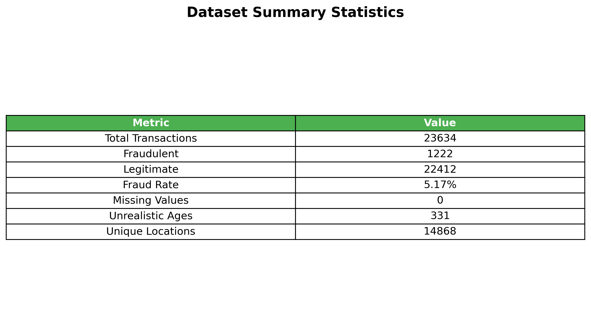

### Data Quality Decisions

#### Customer Age Filtering
**The Problem**: Some customers had unrealistic ages (like 5-year-olds making purchases).
**The Decision**: Filtered to customers 18+ years old.
**Legal Reasoning**: Users under 18 cannot legally agree to user agreements and terms of service, making their transactions potentially invalid from a legal standpoint.
**Impact**: Focused on adult customers with predictable fraud patterns, removing 1,054 unrealistic transactions. For now, we're dropping under-18 users and will consult with management on how they want to handle this demographic.

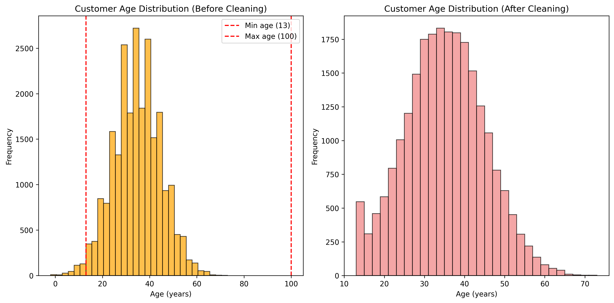

#### Transaction Amount Handling
**The Problem**: Transaction amounts were heavily skewed (skewness of 6.7).
**The Decision**: Used log transformation instead of capping.
**Why It Worked**: Capping would break generalizability for new high-value products. Log transformation reduced skewness to -0.228 while preserving the ability to handle new products.

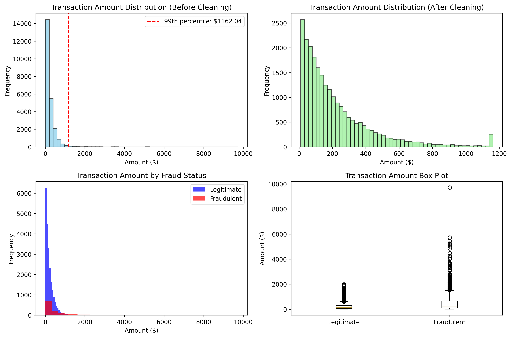
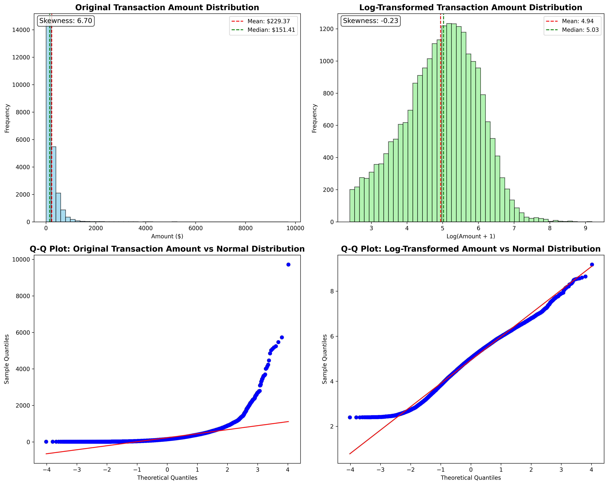

#### Feature Selection Strategy
**The Problem**: Some columns looked useful but were actually noise.
**The Decision**: Removed 5 columns (Transaction ID, Customer ID, IP Address, Shipping/Billing Address) because they contained all unique values.
**Why It Worked**: Reduced noise and improved model convergence.

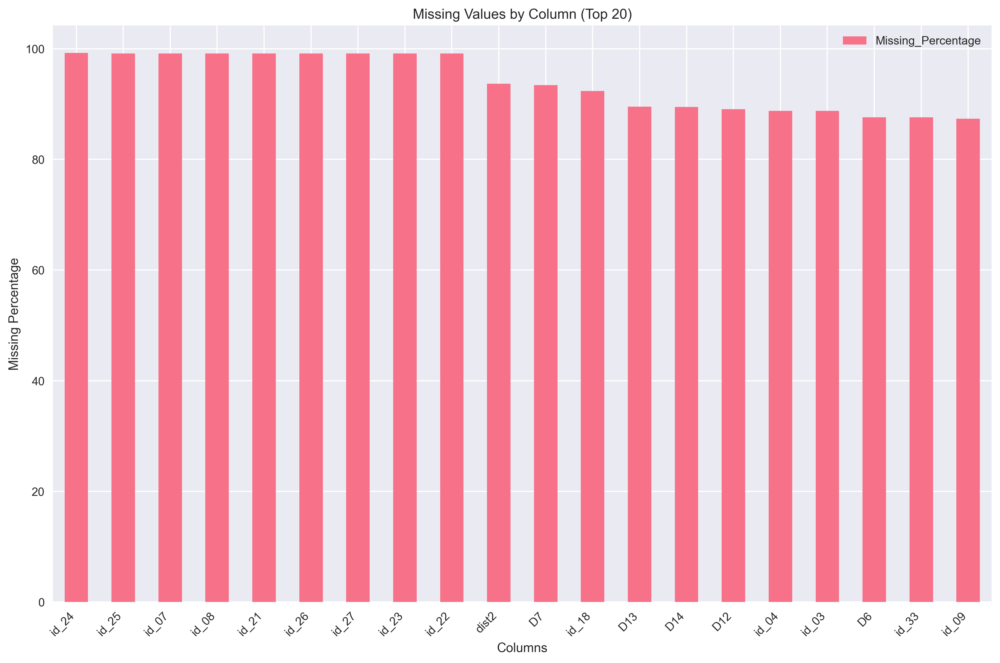

### Feature Sweep Performance

Our systematic testing revealed that combining all feature strategies provides the best performance:

| Strategy | ROC AUC | Improvement | What It Tests |
|----------|---------|-------------|---------------|
| **Combined** | **0.6511** | **+9.36%** | All features together |
| Behavioural | 0.6235 | +4.72% | Purchase behavior patterns |
| Demographic Risk | 0.6164 | +3.52% | Age-based risk scoring |
| Temporal | 0.6119 | +2.77% | Time-based patterns |
| Baseline | 0.5954 | - | Core transaction features |

### Model Performance Visualization

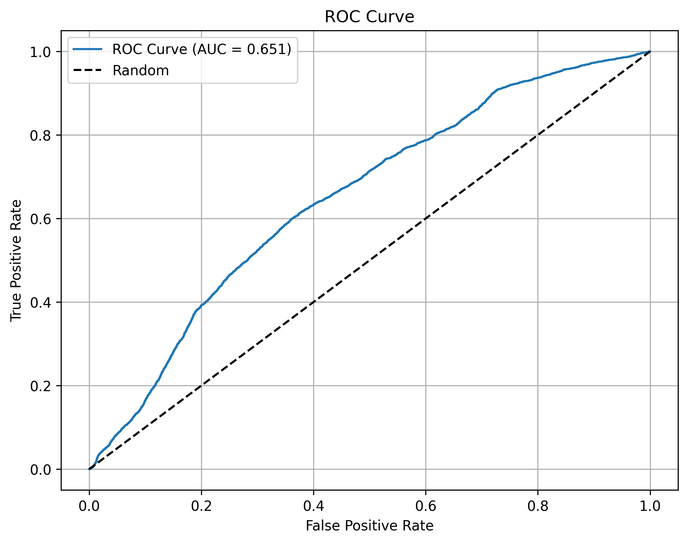
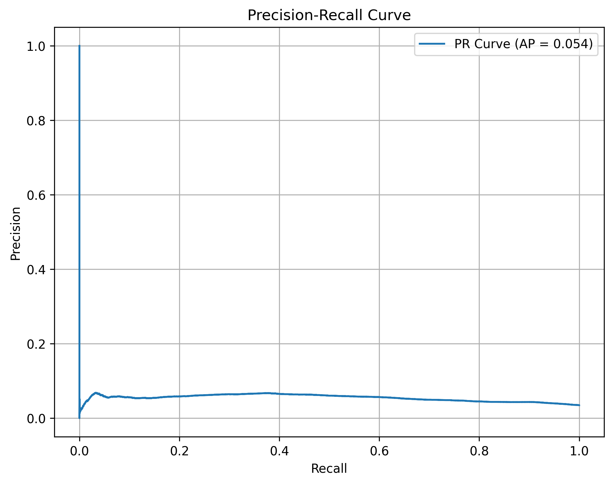
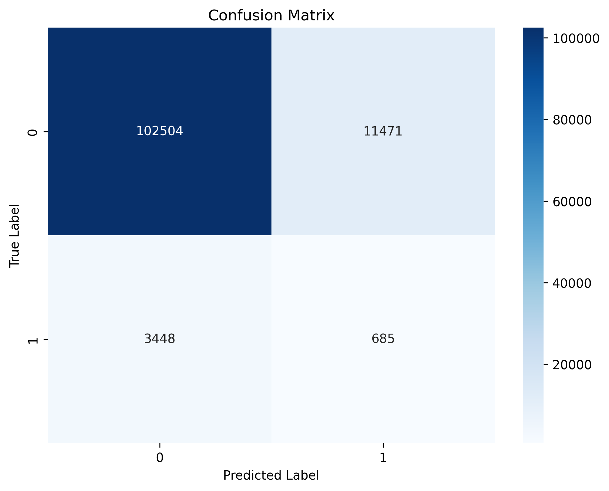

### Key Insights

The results show that:
1. **More features help**: The combined strategy outperforms individual strategies
2. **Behavioral patterns matter**: Amount per item is a strong fraud indicator
3. **Time matters**: Night-time transactions are indeed suspicious
4. **Age matters**: Younger customers show higher fraud risk

### Performance Metrics

- **Best Strategy**: Combined features (ROC AUC: 0.6511)
- **Improvement over Baseline**: +9.36%
- **Training Time**: ~1 minute per strategy
- **Total Features**: 12 unique features

### Temporal Patterns

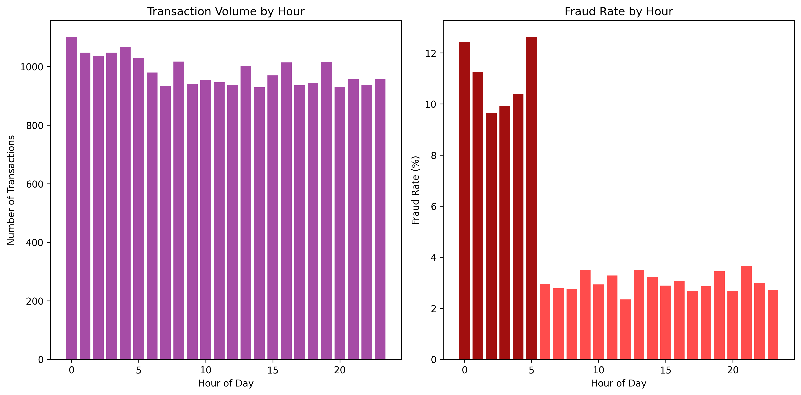

### Payment Method Analysis

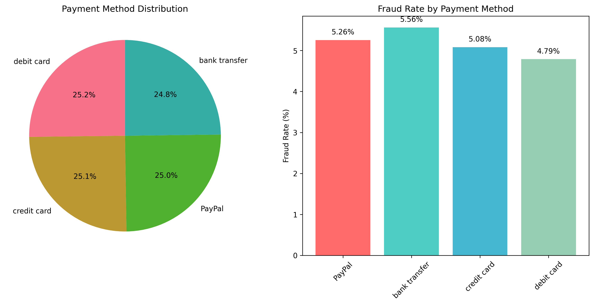

### Error Distribution

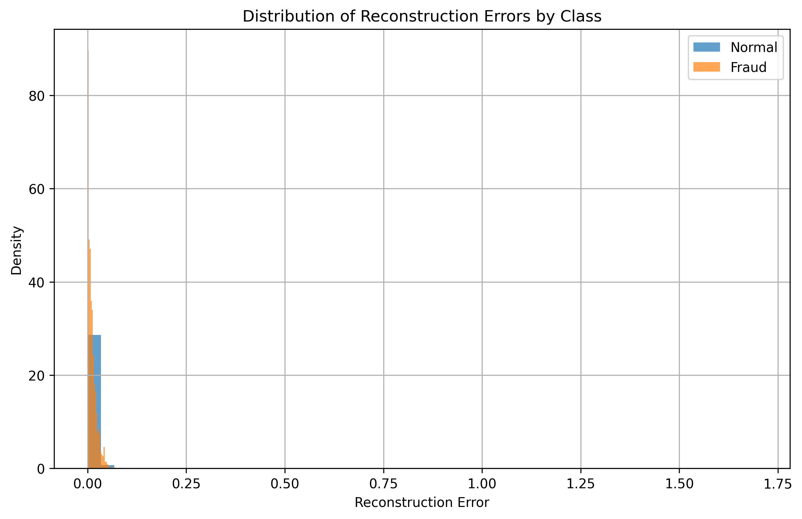

## 🤝 Contributing

This project demonstrates production-ready ML engineering practices. We welcome contributions!

### How to Contribute

1. **Fork the repository**
2. **Create a feature branch**: `git checkout -b feature/amazing-feature`
3. **Make your changes**: Add new feature strategies, improve models, or enhance documentation
4. **Test your changes**: Ensure all tests pass and the pipeline runs successfully
5. **Submit a pull request**: Describe your changes and their impact

### Areas for Contribution

- **New Feature Strategies**: Implement `FeatureEngineer` interface
- **Model Improvements**: Enhance the autoencoder architecture
- **Evaluation Metrics**: Add new performance measures
- **Documentation**: Improve guides and examples
- **Performance Optimization**: Speed up the pipeline

### Development Setup

```bash
# Install development dependencies
pip install -r requirements-dev.txt

# Run tests
python -m pytest tests/

# Run linting
flake8 src/
black src/
```

## 🧪 Tests

### Running Tests

```bash
# Run all tests
python -m pytest tests/

# Run specific test file
python -m pytest tests/test_feature_factory.py

# Run with coverage
python -m pytest --cov=src tests/
```

### Test Coverage

The project includes comprehensive tests for:
- Feature engineering strategies
- Configuration management
- Data cleaning pipeline
- Model training and evaluation
- Pipeline orchestration

### Continuous Integration

Tests are automatically run on:
- Pull requests
- Main branch commits
- Release tags

## 👥 Credits

### Dataset
- **Source**: [Fraudulent E-commerce Transaction Data](https://www.kaggle.com/datasets/arhamrumi/fraudulent-ecommerce-transaction-data)
- **License**: CC0 1.0 Universal

### Key Libraries
- **TensorFlow**: Deep learning framework
- **Scikit-learn**: Machine learning utilities
- **Pandas**: Data manipulation
- **NumPy**: Numerical computing

### Inspiration
This project was inspired by the need for robust, unsupervised fraud detection systems that can adapt to evolving fraud patterns without requiring labeled fraud examples.

## 📞 Contact

### Get in Touch
- **Issues**: [GitHub Issues](https://github.com/yourusername/auto-encoder-project/issues)
- **Discussions**: [GitHub Discussions](https://github.com/yourusername/auto-encoder-project/discussions)
- **Email**: your.email@example.com

### Support
For questions about:
- **Installation**: Check the [Installation](#-installation) section
- **Usage**: See the [Usage](#-usage) section and examples
- **Architecture**: Review the [Architecture](#-architecture) documentation
- **Contributing**: Read the [Contributing](#-contributing) guidelines

## 📄 License

This project is licensed under the MIT License - see the [LICENSE](LICENSE) file for details.

### License Summary
- **Permissions**: Commercial use, modification, distribution, private use
- **Limitations**: Liability, warranty
- **Conditions**: License and copyright notice

---

*This project demonstrates that with the right architecture and systematic experimentation, unsupervised learning can be surprisingly effective for fraud detection. The modular design makes it easy to extend and improve as new insights emerge.* 